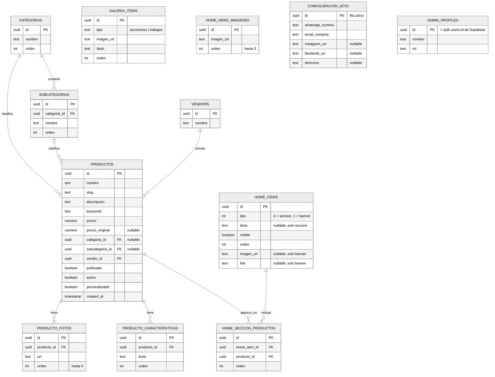

# Barzol Web — Esquema de Base de Datos

Diagrama entidad-relación completo, derivado de todo lo construido en el panel de administración (Productos, Categorías, Página de inicio, Galería, Login). Reemplaza al borrador inicial de `ARCHITECTURE.md` § "Esquema de Base de Datos", que solo cubría 3 tablas básicas y no reflejaba la jerarquía de categorías de 2 niveles, las fotos/características múltiples de producto, ni la estructura de la página de inicio.

Motor: PostgreSQL (Supabase). Imágenes: solo se guarda la URL (Cloudflare R2), nunca el binario. IDs: UUID en todas las tablas, por convención del proyecto.

## Diagrama

> `ADMIN_PROFILES` no tiene flechas de relación propias porque solo extiende `auth.users` de Supabase Auth (login del panel) — su `id` es el mismo `id` de `auth.users`, no una FK independiente representable en este diagrama.

## Detalle por dominio

### Categorías — origen: [`CategoriesAdmin.tsx`](src/admin/categorias/CategoriesAdmin.tsx)

Árbol de 2 niveles: **categoría** = instrumento (Trompeta, Clarinete...), **subcategoría** = tipo de accesorio (Soporte de celular, Sordina, BERP...).

**`categorias`**
| Campo | Tipo | Notas |
|---|---|---|
| id | uuid | PK |
| nombre | text | |
| orden | int | posición para drag-and-drop en el admin |

**`subcategorias`**
| Campo | Tipo | Notas |
|---|---|---|
| id | uuid | PK |
| categoria_id | uuid | FK → `categorias.id`, `ON DELETE CASCADE` (al borrar categoría se borran sus subcategorías, como ya advierte el modal de confirmación) |
| nombre | text | |
| orden | int | |

### Productos — origen: [`ProductsAdmin.tsx`](src/admin/productos/ProductsAdmin.tsx)

**`vendors`**
| Campo | Tipo | Notas |
|---|---|---|
| id | uuid | PK |
| nombre | text | ej. `BARZOL` — hoy es un único vendor fijo en el mock (`ProductosView.astro`), pero ya se maneja como lista seleccionable en el admin |

**`productos`**
| Campo | Tipo | Notas |
|---|---|---|
| id | uuid | PK |
| nombre | text | |
| slug | text | único, usado en `/producto/[slug]` |
| descripcion | text | |
| keywords | text | términos de búsqueda internos |
| precio | numeric | |
| precio_original | numeric | nullable — precio tachado cuando hay descuento |
| categoria_id | uuid | FK → `categorias.id`, nullable (accesorios genéricos sin instrumento asociado, ej. "Tope Protector de Vara") |
| subcategoria_id | uuid | FK → `subcategorias.id`, nullable (hay productos sin subcategoría, ej. "Soporte de Celular Saxo Tenor") |
| vendor_id | uuid | FK → `vendors.id` |
| publicado | boolean | `true` = Publicado, `false` = Borrador |
| activo | boolean | visible/oculto en la tienda, independiente de `publicado` |
| personalizable | boolean | |
| created_at | timestamp | |

**`producto_fotos`** (hasta 5 por producto, reordenables)
| Campo | Tipo | Notas |
|---|---|---|
| id | uuid | PK |
| producto_id | uuid | FK → `productos.id`, `ON DELETE CASCADE` |
| url | text | referencia a R2 |
| orden | int | la de `orden = 0` es la foto principal |

**`producto_caracteristicas`** (lista de bullets del producto, reordenable)
| Campo | Tipo | Notas |
|---|---|---|
| id | uuid | PK |
| producto_id | uuid | FK → `productos.id`, `ON DELETE CASCADE` |
| texto | text | |
| orden | int | |

### Galería — origen: [`GalleryAdmin.tsx`](src/admin/shared/GalleryAdmin.tsx)

Una sola tabla sirve a las dos galerías del sitio (Accesorios personalizados y Trabajos de ingeniería), distinguidas por `tipo`.

**`galeria_items`**
| Campo | Tipo | Notas |
|---|---|---|
| id | uuid | PK |
| tipo | text/enum | `accesorios` \| `trabajos` |
| imagen_url | text | referencia a R2 |
| titulo | text | caption mostrado bajo la foto |
| orden | int | reordenable por drag-and-drop, independiente por `tipo` |

### Página de inicio — origen: [`InicioAdmin.tsx`](src/admin/inicio/InicioAdmin.tsx)

La más compleja: 3 imágenes hero fijas + una lista unificada y reordenable de **secciones de productos** y **banners** intercalados.

**`home_hero_imagenes`** (máx. 3 filas)
| Campo | Tipo | Notas |
|---|---|---|
| id | uuid | PK |
| imagen_url | text | referencia a R2 |
| orden | int | 0, 1, 2 |

**`home_items`** (secciones y banners en una sola tabla reordenable, como en la UI)
| Campo | Tipo | Notas |
|---|---|---|
| id | uuid | PK |
| tipo | int | `0` = sección, `1` = banner |
| titulo | text | nullable — solo aplica a `seccion` |
| visible | boolean | toggle Visible/Oculta del admin |
| orden | int | orden combinado entre secciones y banners |
| imagen_url | text | nullable — solo aplica a `banner` |
| link | text | nullable — solo aplica a `banner`, ruta interna opcional |

**`home_seccion_productos`** (tabla puente: qué productos aparecen en cada sección, y en qué orden)
| Campo | Tipo | Notas |
|---|---|---|
| id | uuid | PK |
| home_item_id | uuid | FK → `home_items.id` (`tipo = 'seccion'`), `ON DELETE CASCADE` |
| producto_id | uuid | FK → `productos.id` |
| orden | int | orden del producto dentro de esa sección |

### Configuración — pendiente de traer del diseño, columnas inferidas de la tarjeta "Configuración" del dashboard (`Contacto, WhatsApp y redes`)

**`configuracion_sitio`** (tabla singleton — siempre una sola fila)
| Campo | Tipo | Notas |
|---|---|---|
| id | uuid | PK |
| whatsapp_numero | text | usado por `WhatsAppButton.astro` |
| email_contacto | text | |
| instagram_url | text | nullable |
| facebook_url | text | nullable |
| direccion | text | nullable |

### Autenticación del admin — origen: [`LoginView.astro`](src/admin/login/LoginView.astro), pendiente de conectar a Supabase Auth

**`admin_profiles`** (extiende `auth.users` de Supabase, no la reemplaza)
| Campo | Tipo | Notas |
|---|---|---|
| id | uuid | PK, igual a `auth.users.id` |
| nombre | text | mostrado en el badge del sidebar (hoy hardcodeado como "Administrador") |
| rol | text | por si en el futuro hay más de un tipo de usuario admin |

## Notas de migración (mock → Supabase)

- Todo el estado que hoy vive en `useState` de las islas React (`ProductsAdmin`, `CategoriesAdmin`, `InicioAdmin`, `GalleryAdmin`) es exactamente lo que estas tablas deben persistir — los tipos TypeScript de cada isla (`AdminProduct`, `AdminCategory`, `HomeItem`, `GalleryPhoto`) ya son, en la práctica, el contrato de la API.
- Cuando se conecte Supabase, solo cambian los archivos `shared/lib/[feature]/[feature]Service.ts` (ver `ARCHITECTURE.md` § Estructura de Carpetas) — ninguna vista ni isla debería tocarse.
- Los botones "Guardar cambios" de cada página admin ya delimitan exactamente qué operación de escritura dispara cada tabla (marcada con comentarios `// TODO: reemplazar por @shared/lib/...` en el código).
