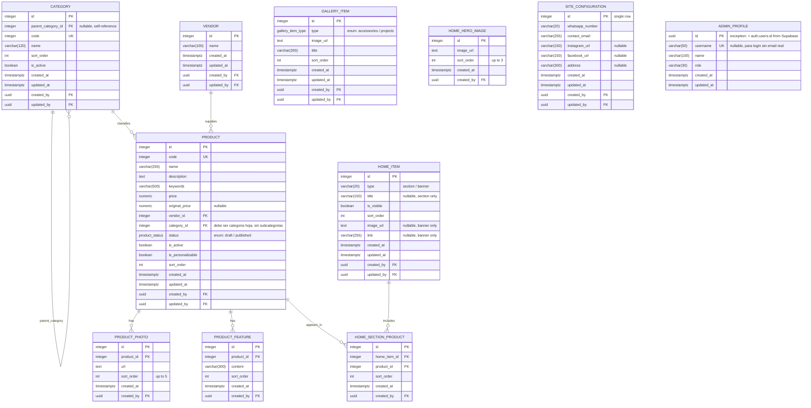

# Barzol Web — Esquema de Base de Datos (v9 — tablas en singular)

Esquema definitivo, con nombres de tabla en singular (`product`, `category`, `vendor`...) en vez de plural. Motor: PostgreSQL (Supabase).

## Diagrama



> **`admin_profile.id` sigue siendo la única excepción** a "todo id numérico" — es el mismo `id` de `auth.users` de Supabase Auth (siempre UUID). Por eso `created_by` / `updated_by` en el resto de tablas también son UUID.

## Tablas y columnas

### `category` — autorreferenciada, profundidad libre
| Columna | Tipo | Notas |
|---|---|---|
| id | integer | PK, identity |
| parent_category_id | integer | FK → `category.id`, nullable, `ON DELETE CASCADE` |
| code | integer | único, numérico — pensado para escribirse/escanearse fácil en inventario, ya no interviene en la url (eso lo resuelve `id`) |
| name | varchar(120) | texto visible al usuario |
| sort_order | int | posición relativa a `parent_category_id` |
| is_active | boolean | default `true` |
| created_at / updated_at / created_by / updated_by | — | auditoría |

### `vendor`
| Columna | Tipo | Notas |
|---|---|---|
| id | integer | PK, identity |
| name | varchar(100) | nombre comercial de la marca/proveedor |
| created_at / updated_at / created_by / updated_by | — | auditoría |

### `product`
| Columna | Tipo | Notas |
|---|---|---|
| id | integer | PK, identity |
| code | integer | único — código numérico corto tipo SKU, fácil de anotar/escanear en inventario |
| name | varchar(255) | |
| description | text | puede ser un párrafo largo, sin límite práctico |
| keywords | varchar(500) | búsqueda interna |
| price | numeric(10,2) | |
| original_price | numeric(10,2) | nullable — precio tachado |
| vendor_id | integer | FK → `vendor.id` |
| category_id | integer | FK → `category.id`. **Regla de negocio:** debe apuntar a una categoría "hoja" (sin subcategorías propias) — no se puede asignar un producto a una categoría intermedia. Esto no se puede validar con un `CHECK` simple en SQL (requiere consultar si la categoría tiene hijos), así que se aplica con un trigger `BEFORE INSERT/UPDATE` o validación en el backend antes de guardar |
| status | `product_status` (enum) | `draft` \| `published`. Ver definición del tipo abajo |
| is_active | boolean | visible/oculto, independiente de `status` |
| is_personalizable | boolean | |
| sort_order | int | orden del producto dentro de su categoría — ya no es ambiguo porque cada producto tiene una sola categoría |
| created_at / updated_at / created_by / updated_by | — | auditoría |

### `product_photo`
| Columna | Tipo | Notas |
|---|---|---|
| id | integer | PK, identity |
| product_id | integer | FK → `product.id`, `ON DELETE CASCADE` |
| url | text | referencia a R2 — URLs firmadas pueden traer tokens largos, se deja sin límite |
| sort_order | int | `sort_order = 0` es la foto principal |
| created_at / created_by | — | auditoría |

### `product_feature`
| Columna | Tipo | Notas |
|---|---|---|
| id | integer | PK, identity |
| product_id | integer | FK → `product.id`, `ON DELETE CASCADE` |
| content | varchar(300) | un bullet, no un párrafo — nombre elegido para no chocar con el tipo de dato `text` |
| sort_order | int | |
| created_at / created_by | — | auditoría |

### `gallery_item`
| Columna | Tipo | Notas |
|---|---|---|
| id | integer | PK, identity |
| type | `gallery_item_type` (enum) | `accessories` \| `projects`. Ver definición del tipo abajo |
| image_url | text | referencia a R2 — URLs firmadas pueden traer tokens largos |
| title | varchar(200) | caption bajo la foto |
| sort_order | int | reordenable, independiente por `type` |
| created_at / updated_at / created_by / updated_by | — | auditoría |

### `home_hero_image`
| Columna | Tipo | Notas |
|---|---|---|
| id | integer | PK, identity |
| image_url | text | referencia a R2 |
| sort_order | int | 0, 1, 2 |
| created_at / created_by | — | auditoría |

### `home_item`
| Columna | Tipo | Notas |
|---|---|---|
| id | integer | PK, identity |
| type | varchar(20) | `section` \| `banner` |
| title | varchar(150) | nullable — solo `section`, títulos de sección son frases cortas |
| is_visible | boolean | |
| sort_order | int | orden combinado entre secciones y banners |
| image_url | text | nullable — solo `banner`, URLs firmadas pueden ser largas |
| link | varchar(255) | nullable — solo `banner` |
| created_at / updated_at / created_by / updated_by | — | auditoría |

### `home_section_product` (tabla puente)
| Columna | Tipo | Notas |
|---|---|---|
| id | integer | PK, identity |
| home_item_id | integer | FK → `home_item.id` (`type = 'section'`), `ON DELETE CASCADE` |
| product_id | integer | FK → `product.id` |
| sort_order | int | |
| created_at / created_by | — | auditoría |

### `site_configuration` (singleton)
| Columna | Tipo | Notas |
|---|---|---|
| id | integer | PK, identity |
| whatsapp_number | varchar(20) | |
| contact_email | varchar(255) | máximo real permitido por RFC 5321 |
| instagram_url | varchar(150) | nullable — acotado al patrón real de URL de perfil |
| facebook_url | varchar(150) | nullable — acotado al patrón real de URL de perfil |
| address | varchar(300) | nullable — direcciones en Perú suelen llevar referencia adicional |
| created_at / updated_at / created_by / updated_by | — | auditoría |

### `admin_profile`
| Columna | Tipo | Notas |
|---|---|---|
| id | **uuid** | PK — excepción, igual a `auth.users.id` |
| username | varchar(50) | nullable, único. Solo se usa si el login es por usuario simple en vez de email real (ver nota abajo) |
| name | varchar(100) | |
| role | varchar(30) | |
| created_at / updated_at | — | auditoría (sin `created_by`/`updated_by`: es la tabla origen) |

## Convenciones de nombres (actualizadas a inglés)

| Elemento | Convención | Ejemplos |
|---|---|---|
| Tabla | `snake_case`, singular, inglés | `product`, `category`, `product_photo` |
| Tabla puente | `<table_a_singular>_<table_b_singular>` | `home_section_product` |
| Tabla singleton | singular (ya alineada con la convención general) | `site_configuration` |
| PK | siempre `id` | `id BIGINT GENERATED ALWAYS AS IDENTITY` |
| FK simple | `<referenced_table_singular>_id` | `product_id`, `category_id` |
| FK autorreferenciada | `parent_<table_singular>_id` | `parent_category_id` |
| Booleanos | prefijo `is_` o `has_` | `is_active`, `is_visible`, `is_personalizable` |
| Auditoría de fecha | `created_at`, `updated_at` (`timestamptz`) | — |
| Auditoría de usuario | `created_by`, `updated_by` (`uuid`, FK → `admin_profile.id`) | — |
| Identificador de negocio | `code` (integer) | en `category` y `product` — código numérico corto para uso interno/inventario, independiente de `id` (que es el que arma la url) |
| Slug público | no se guarda | se calcula al vuelo desde `name` en tablas con página propia (`product`) — ver nota sobre URL |
| Texto corto/acotado | `varchar(n)` | nombres, códigos, emails, teléfonos, valores de enum — cualquier campo con largo máximo predecible |
| Texto sin límite práctico | `text` | descripciones largas y URLs firmadas de R2 (pueden traer tokens extensos en el query string) |

## Nota sobre `vendor` (agregada tras confirmar múltiples marcas/proveedores)

El campo `vendor` (texto libre) de la v5 se reemplaza por `vendor_id`, FK a la nueva tabla `vendor`. Motivo: al manejar varias marcas, un campo de texto libre genera inconsistencias (`"Barzol"` vs `"BARZOL"` vs `"barzol "` se tratarían como 3 valores distintos al filtrar o agrupar).

Se mantiene deliberadamente mínima: solo `id` y `name` (más auditoría, por convención del esquema). Si más adelante necesitas mostrar logo de marca, sitio web, o "ver más de esta marca" en la ficha de producto, se pueden agregar esas columnas después sin romper nada, ya que el resto del esquema solo depende de `vendor_id`.

El formulario de producto en el admin debe cambiar el campo de texto libre `vendor` por un select de `vendor` (idealmente con opción de "crear proveedor nuevo" inline, igual que se sugiere para categorías).

## Nota sobre `product.category_id` (revertido a 1 sola categoría por producto)

Se elimina `product_categories` (muchos a muchos). Cada producto vuelve a tener **una sola** `category_id`, con una regla adicional: debe ser una categoría de último nivel (sin subcategorías propias) — nunca una categoría intermedia como "Accesorios".

**Trade-off aceptado conscientemente:** con esto, un producto ya no puede pertenecer simultáneamente a, por ejemplo, `Sordinas` y `Trompeta`. El filtro cruzado "ver todo lo de Trompeta" (sordinas + soportes + lo que sea, todo compatible con ese instrumento) **ya no es posible con este modelo**, salvo que en el futuro se agregue el instrumento como un atributo/etiqueta aparte del árbol de categorías — la alternativa que se descartó antes en la conversación. Queda documentado aquí para que la decisión no se pierda de vista más adelante si el negocio la vuelve a necesitar.

**Cómo validar la regla "solo categorías hoja":** un `CHECK` de columna no puede consultar si `category_id` tiene hijos en la misma tabla `category`. Dos formas de aplicarlo:
- **Trigger de base de datos** (`BEFORE INSERT OR UPDATE ON product`) que verifique `NOT EXISTS (SELECT 1 FROM category WHERE parent_category_id = NEW.category_id)`.
- **Validación en el backend**, antes de guardar — más simple de mantener, pero depende de que todo el código pase siempre por esa capa (un trigger es más seguro porque protege incluso ante escrituras directas a la base de datos).

## Nota sobre `product.status` (enum nativo en vez de varchar)

Se define como tipo `ENUM` nativo de PostgreSQL en vez de `varchar` con `CHECK`, aprovechando que Supabase genera automáticamente el tipo TypeScript correspondiente (autocompletado en el admin, sin valores inválidos posibles).

**Definición del tipo:**
```sql
CREATE TYPE product_status AS ENUM ('draft', 'published');
```

**Cómo se agrega un estado nuevo más adelante** (ej. `agotado`, identificado como el más probable dado que manejas stock físico):
```sql
ALTER TYPE product_status ADD VALUE 'agotado';
```
Nota: el valor nuevo no se puede usar en la misma transacción en la que se agrega (limitación de Postgres) — en la práctica esto no afecta nada, solo hay que correr el `ALTER TYPE` como paso separado antes de empezar a usarlo.

**Se deja fuera de esta versión** (no se agrega `agotado` todavía): quedó identificado como el estado más probable a futuro, pero no se incluye hasta que sea una necesidad real del negocio, para no anticipar reglas de UI (badges, filtros) que aún no existen.

## Nota sobre login del admin (email real o usuario simple)

**Principio clave: la contraseña nunca se guarda en ninguna tabla de este esquema, en ningún escenario.** Su almacenamiento (hash + salt) lo maneja por completo Supabase Auth en su tabla interna `auth.users` (columna `encrypted_password`, no expuesta vía API). No se crea columna `password` en `admin_profile` bajo ninguna circunstancia.

**Escenario A — login con email real:**
Flujo directo, sin pasos intermedios: el formulario de login llama a `supabase.auth.signInWithPassword({ email, password })`. Supabase valida internamente contra su hash. No requiere el campo `username`.

**Escenario B — login con usuario simple (ej. `admin`, no un email):**
Supabase Auth exige un email como identificador interno — no se puede evitar, es parte de cómo está construido el servicio. Se resuelve así:
1. Al crear el admin, se le asigna un **email sintético interno** que nunca se usa para enviar correos (ej. `admin@barzol.internal`) — ese es el email real registrado en `auth.users`.
2. El `username` visible (lo que el admin escribe para entrar) se guarda en `admin_profile.username`.
3. Flujo de login: el usuario escribe su `username` → la app hace una consulta pública de solo lectura a `admin_profile` para obtener el email sintético asociado → se llama a `signInWithPassword` con ese email + la contraseña ingresada.

Este paso 3 es seguro porque el "email interno" no protege nada por sí mismo — la seguridad completa sigue recayendo en la contraseña, validada exclusivamente por Supabase.

**Ambos escenarios pueden convivir:** un admin puede tener `username` lleno (login simple) y otro puede dejarlo `NULL` y usar su email real — por eso el campo es nullable.

## Nota sobre `gallery_item.type` (enum, por consistencia con `product.status`)

Igual que `product.status`, se define como `ENUM` nativo en vez de `varchar` — no por una ganancia de velocidad real (con el volumen de una tabla de galería administrada a mano, la diferencia de performance es inmedible), sino por **validación a nivel de base de datos** y para aprovechar el **autocompletado de TypeScript** que Supabase genera automáticamente a partir de tipos enum.

```sql
CREATE TYPE gallery_item_type AS ENUM ('accessories', 'projects');
```

## Nota sobre optimización de espacio (plan gratuito de Supabase, 500 MB)

**Cambio aplicado: `bigint` → `integer` en todas las PK y FK del esquema** (excepto `admin_profile.id`, `created_by`, `updated_by`, que siguen en `uuid` por estar atados a `auth.users` de Supabase). `integer` ocupa la mitad que `bigint` (4 bytes vs 8) y soporta más de 2,100 millones de filas — muy por encima de lo que este catálogo va a necesitar.

**Lo que ya estaba bien y es lo que realmente importa:** ninguna tabla guarda binarios (imágenes, PDFs) — todo son URLs a Cloudflare R2. Esta es, con diferencia, la decisión de mayor impacto en espacio: una sola foto de producto puede pesar 1-3 MB si se guardara como binario; guardar solo su URL pesa unos 100-200 bytes. Con esto, es muy difícil que este proyecto se acerque a los 500 MB solo por datos de catálogo, incluso con miles de productos.

**Recomendaciones adicionales, de menor impacto pero sin costo de implementarlas:**
- Evitar índices innecesarios: cada `UNIQUE` y cada FK ya crea un índice automáticamente — no agregar índices manuales salvo que una consulta específica lo necesite (cada índice extra también ocupa espacio en disco).
- Si en algún momento decides limpiar datos viejos (ej. productos dados de baja hace mucho), un `DELETE` real libera espacio; un simple `is_active = false` no lo hace, porque la fila sigue existiendo.

**Lo que NO vale la pena optimizar más:** los tamaños de `varchar` que ya definimos (150, 255, 300, etc.) no reservan espacio fijo en Postgres — a diferencia de otros motores, un `varchar(255)` con un valor de 10 caracteres ocupa lo que pesan esos 10 caracteres, no los 255. Reducir esos números no ahorra espacio real, solo limita la validación.

## Nota sobre la URL del producto (`slug` calculado + `id` guardado)

La URL pública del producto combina un slug con el `id` en un solo segmento, con el id al final:

```
/product/sordina-recta-trompeta-89898
```

**Diferencia clave respecto a versiones anteriores de esta nota: el slug ya NO es una columna en `product`.** Se calcula al vuelo, en el momento de generar cualquier URL (listados, ficha de producto, sitemap), a partir de `product.name` — no se guarda en la base de datos.

**Por qué no guardarlo:**
- **`id`** es quien garantiza la permanencia y unicidad de la URL — el slug ya no cumple ese rol, es puramente decorativo/SEO
- Calcular el slug es una operación de texto liviana (minúsculas, sin tildes, espacios por guiones) — el costo de recalcularlo en cada lectura es insignificante para el volumen de este catálogo
- Evita que quede desactualizado: si `name` cambia y alguien olvida regenerar un slug guardado, la URL mostraría un texto que ya no coincide con el producto actual. Al calcularlo siempre desde `name` en el momento, **nunca puede desincronizarse** — `name` es la única fuente de verdad

**Cómo se arma y se lee (lógica de aplicación, no de base de datos):**
1. En cualquier lugar donde se necesite el link de un producto, se genera el slug al vuelo desde `name` y se concatena con el `id`
2. Al recibir una visita a `/product/sordina-recta-trompeta-89898`, el backend extrae el último bloque de dígitos (`89898`) y busca directo por `id` — el resto del texto se ignora para la búsqueda, solo se usa para mostrar la URL

**En el formulario del admin:** no hay ningún campo de slug que mostrar ni editar — no existe como dato, se genera automáticamente en el momento de construir cada link.

## Nota sobre `code` (numérico, independiente de la URL)

`category.code` y `product.code` pasan de `varchar(30)` a `integer`. La razón ya **no** es para armar la URL (eso lo resuelve `id`, como quedó documentado arriba) — es para uso interno: más rápido de escribir y escanear en inventario que un código alfanumérico.

**Cómo se genera:** es independiente del `id` interno de la tabla (que Postgres asigna automáticamente) — `code` se puede asignar con su propia secuencia numérica de negocio (ej. empezando en 1000, para diferenciarlo visualmente de otros números del sistema), y sigue siendo editable por el admin si alguna vez hace falta corregirlo, a diferencia de `id`.

**No se agrega `alt_text`** en esta versión — queda pendiente para una futura iteración del esquema.

## Nota sobre `code` autogenerado (secuencias, no manual)

`category.code` y `product.code` dejan de requerir que el admin escriba un número — se autogeneran con una secuencia de Postgres (`DEFAULT nextval(...)`), igual que ya funciona `id` internamente, pero en un contador aparte.

**Decisión: una sola secuencia por tabla, sin preservar rangos por significado** (ej. no se reserva 1000s para categorías raíz y 2000s para subcategorías). Motivo: esa separación por rango solo aporta valor si alguien lee el número `code` para entender la jerarquía — pero el admin ya tiene la vista de árbol (anidado, drag-and-drop) para eso visualmente. A diferencia de `product.code` (que sí se usa físicamente al escanear/anotar en inventario), `category.code` no tiene ese uso — es solo un identificador estable. Mantener rangos hubiera requerido un trigger adicional sin beneficio de negocio real.

**Sigue siendo editable después de creado** — el autogenerado es solo el valor por defecto al crear, no una restricción permanente (ver script `add_code_sequences.sql`).

**Importante si ya tienes datos cargados con códigos manuales** (como el catálogo real): las secuencias deben sincronizarse para continuar después del código más alto ya usado, evitando choques. El script incluye ese paso.
